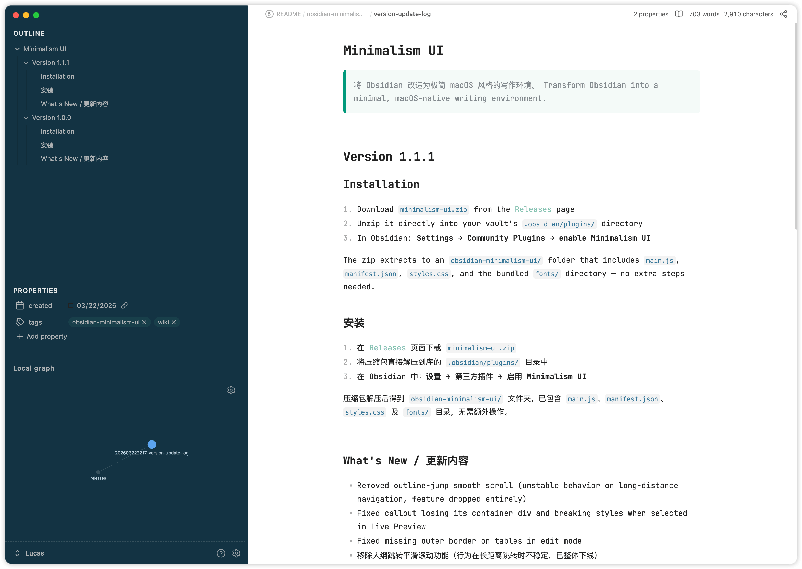

# Minimalism UI — Obsidian Plugin

<kbd>[中文](README.zh.md)</kbd> · <kbd>English</kbd>

Transform Obsidian into a minimal, Typora-style writing environment. All options are in **Settings → Community Plugins → Minimalism UI**.



---

## Read This Before You Start

> [!warning] Make sure this minimalist philosophy suits you before installing
>
> 1. This plugin is all about subtraction, and its philosophy runs against mainstream usage: it keeps only the left sidebar (showing at most Outline, Properties, and Local Graph) and strips away many core features, including Folders.
> 2. Pick one note as your home page. Think of it as the trunk of a tree: keep creating notes from it through backlinks, letting your knowledge branch out until it grows into a towering tree.
> 3. Since folders are gone, almost every note lives in the vault root. Enable timestamp-prefixed filenames to give each note a unique identifier and avoid name clashes.

---

## Features

### Minimal Sidebar

Applies a Typora-style frosted-glass look to the left sidebar (rounded corners, custom background). Also restructures the sidebar: the Outline panel and Properties metadata are merged into a single view — Outline on top, frontmatter properties below — so all note context is visible at a glance without switching panels.

Toggling this option off restores the original sidebar layout.

### Simplified Panel

Hides panel action buttons (the icon row in Outline, Backlinks, etc.) and removes the search bar from those panels, reducing visual noise.

### Note Style

Applies custom typography to the editor and reading view:

- **JetBrains Mono NL** for code blocks, inline code, and the editor font
- Forest-style blockquotes, tables, and code blocks
- Adjusted line height and smooth scroll in the reading view
- Heading flash animation when jumping from the Outline panel

### Home Note

Designates a note that opens automatically on startup and whenever all tabs are closed. Set the path in the plugin settings (supports autocomplete).

### Single-Page Mode

Hides the tab bar and keeps one note visible at a time. Additional navigation features:

- **LRU tab cache** — keeps the 10 most recently visited notes open in the background; the oldest is closed when the limit is reached
- **Cross-tab back / forward** — `app:go-back` / `app:go-forward` navigate across tabs, not just within a single tab's history
- Disables tab pinning

### Page Load Animation *(Beta)*

Slide-in animation when navigating back or forward through note history.

---

## Settings

| Option | Description |
|---|---|
| Minimal Sidebar | Finder-style sidebar + merged Outline + Properties layout |
| Simplified Panel | Hides panel buttons and search bars |
| Note Style | JetBrains Mono, Forest-style blocks, smooth scroll, heading flash |
| Home Note | Note path to open on startup and when all tabs are closed |
| Single-Page Mode | One-note-at-a-time with LRU cache and cross-tab history |
| Page Load Animation | Slide animation on back/forward navigation |

---

## Installation

1. Download `obsidian-minimalism-ui.zip` from the [Releases](../../releases) page
2. Unzip it directly into your vault's `.obsidian/plugins/` directory
3. In Obsidian: **Settings → Community Plugins → enable Minimalism UI**

The zip extracts to an `obsidian-minimalism-ui/` folder containing `main.js`, `manifest.json`, and `styles.css`. Theme styles and fonts are embedded into `main.js` at build time — no extra files or steps needed.

---

## Development

```bash
git clone https://github.com/tcyeee/obsidian-minimalism-ui.git
cd obsidian-minimalism-ui
pnpm install

pnpm build   # production build → main.js
pnpm dev     # watch mode — rebuilds on changes to main.ts / src/**
```

Both commands first run `scripts/generate-theme-assets.mjs`, which embeds the theme CSS and fonts under `theme/` into the bundle. The watcher does **not** watch `theme/` — re-run `pnpm dev` / `pnpm build` after editing theme files.

To test locally, symlink the project directory into your vault:

```bash
ln -s $(pwd) ~/your-vault/.obsidian/plugins/obsidian-minimalism-ui
```

After editing the source, run `pnpm build` and reload the plugin in Obsidian (**Ctrl/Cmd+R** in the community plugins list).

---

## Permissions

| API | Where used | Why |
|---|---|---|
| `vault.getMarkdownFiles()` | Settings tab — file path input | Provides autocomplete suggestions when the user types a path for the Home Note setting. Called only on user keystroke; never runs on startup or in the background. |

---

## License

MIT
