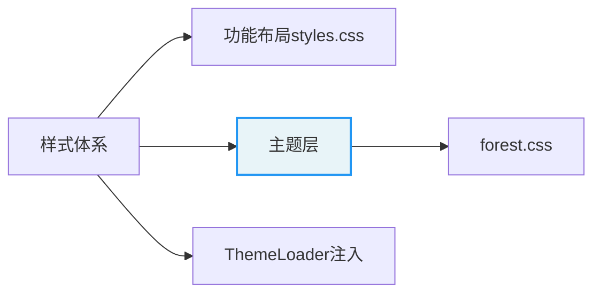

# Forest 主题

Minimalism UI 插件的笔记内容主题。绿色调（主色 `#00997B`），目标是把笔记正文打磨成接近语雀的安静阅读体验：克制的色彩、等宽混排字体、轻量的分隔线与滚动条。

实际样式在同目录的 `forest.css`，由插件的 `ThemeLoader` 在运行时读取并注入 `<style>` 标签。本文件只是给人看的主题说明，插件不会解析它。

## 启用方式

- 全部样式都挂在 `body.minimalism-ui-note-style` 下，由设置里的「笔记样式」开关（`noteStyle`）控制是否生效。
- 加载哪一个主题文件由 `data.json` 的 `theme` 字段决定（默认 `forest`），对应 `theme/<name>.css`。设置面板提供下拉框，选项来自 `theme/` 目录下的 `*.css` 文件。
- 新增一个主题：在 `theme/` 放一个 `<name>.css`，写一份 `<name>.md` 说明，下拉框会自动出现该选项。

## 调色板

| 用途 | 取值 |
| --- | --- |
| 主色（引用条、强调） | `#00997B` |
| 主色浅底（引用块/表头/斑马纹背景） | `rgba(0, 153, 123, 0.03 ~ 0.05)` |
| 正文次要文字（引用、表格单元格） | `#81888D` / `rgb(107, 107, 107)` |
| 行内代码文字 | `#347698` |
| 行内代码背景 | `#F3F3F3` |
| 边框/分隔线 | `#DADCDE` |
| 滚动条滑块（悬停时） | `rgba(128, 128, 128, 0.4)` |

## 字体与排版

- 正文与编辑器统一用 `JetBrains Mono NL` 打头的字体栈，ASCII 走等宽，中文 fallback 到 PingFang SC 等。正文 `15px`，行高 `1.74`，关闭连字。
- 标题在编辑视图还原为 `--hX-size`，与预览模式字号一致。
- 关闭内部链接下划线（`--link-decoration: none`）。

## 各模块说明

- **引用块**：无边框，浅绿底 `border-radius: 6px`，左侧一条 `0.3rem` 主色竖条（阅读视图用 `::before`，编辑视图用 `cm-blockquote-border`）。
- **代码**：围栏代码块 `13px` 圆角 `5px`；行内代码蓝绿字配浅灰底。无语言标注的代码块降低到 `0.9` 透明度。
- **分割线**：`1px dashed #DADCDE`，阅读与编辑视图一致。
- **滚动条**：`3px` 细条，平时透明，悬停才显灰。Bases 视图与 Mermaid 单独适配。
- **表格**：圆角外框 `5px`，表头与偶数行浅绿斑马纹，单元格等宽小一号字。编辑模式额外提供悬浮的行/列拖拽把手（表格外侧，hover 才显现）。
- **Callout / 脚注**：正文降到 `0.9rem` 并轻微减淡，弱化次要信息。
- **Mermaid**：超宽时横向滚动而非缩放；`fit-view` 时填满宽度并给出 `zoom-in/zoom-out` 光标提示；节点文字 `nowrap` 且与正文同字号。

## 知识地图

本文属于 Minimalism UI 插件的主题层，与 [功能性布局样式](../styles.css)、[主题加载器 ThemeLoader](../src/core/ThemeLoader.ts) 同属该插件的样式体系。

